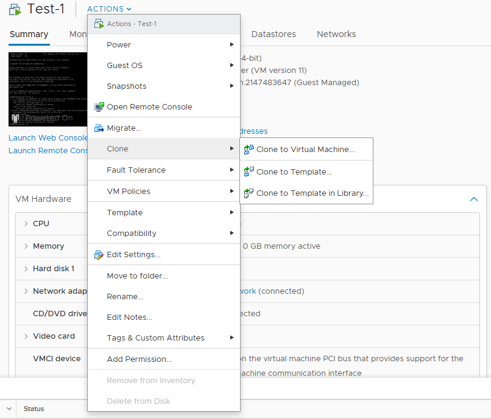
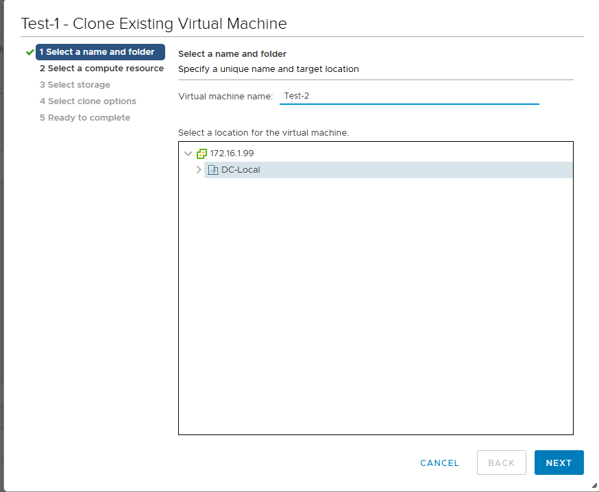
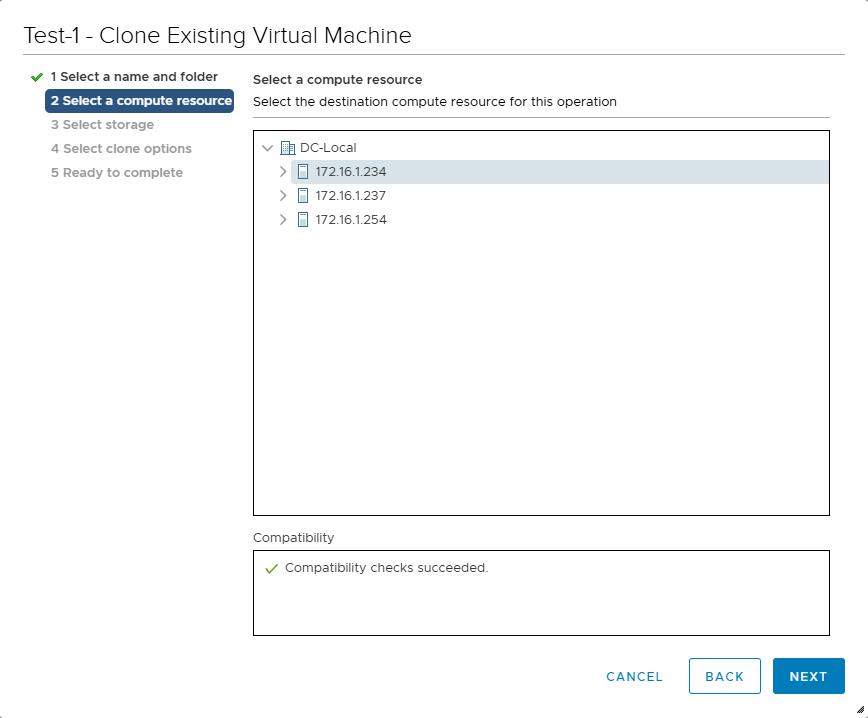
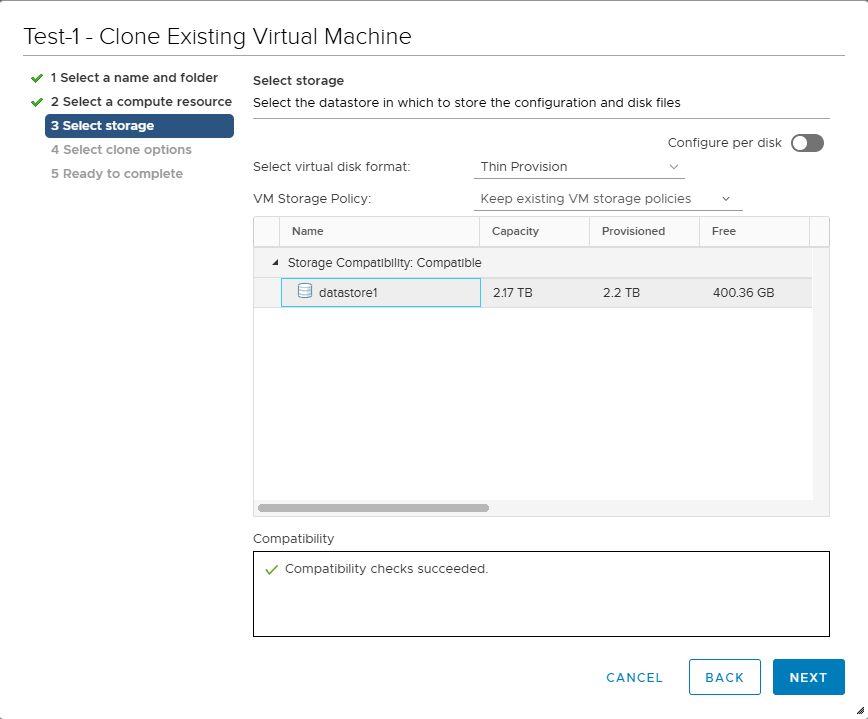
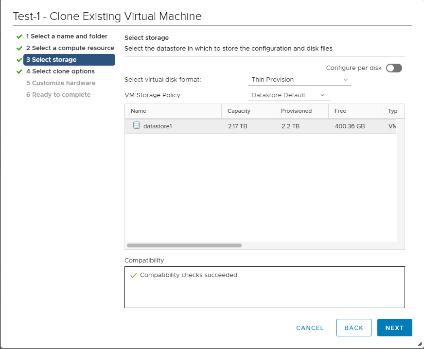
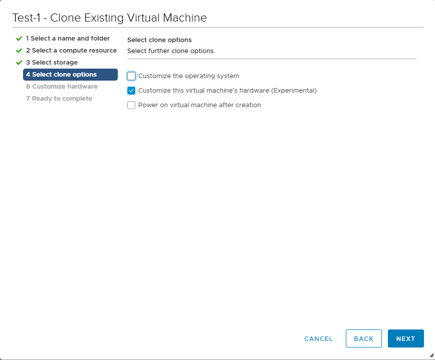
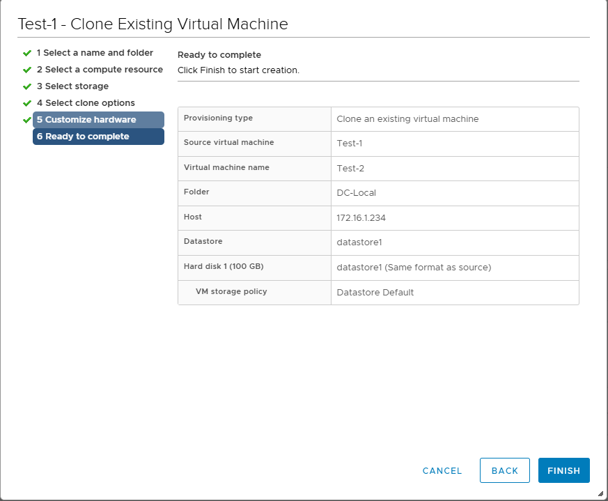

# **Clone trực tiếp**

- **Chuột phải VM → Clone → Clone to Virtual Machine**















-  **FINISH => Quá trình này sẽ tạo ra một VM giống VM gốc → Khi clone xong, chuột phải VM => ACTIONS => Power => Power On (bật VM)**

- **Đăng nhập vào server → Đổi địa chỉ IP Private**
```sh
sudo nano /etc/netplan/50-cloud-init.yaml
```
- **Cập nhật cấu hình, thay đổi `addresses`:**
```conf
# This file is generated from information provided by the datasource.  Changes
# to it will not persist across an instance reboot.  To disable cloud-init's
# network configuration capabilities, write a file
# /etc/cloud/cloud.cfg.d/99-disable-network-config.cfg with the following:
# network: {config: disabled}
network:
    ethernets:
        ens160:
            addresses:
            - 172.16.1.29/24
            nameservers:
                addresses: []
                search: []
            routes:
            -   to: default
                via: 172.16.1.1
    version: 2

```
```sh
sudo netplan apply
```
