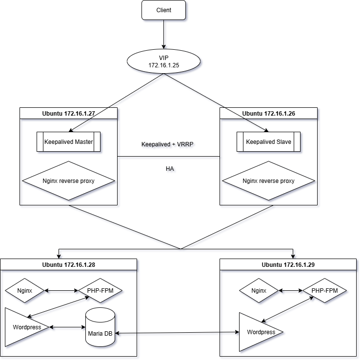

# Cài đặt và cấu hình Keepalive với nginx reverse proxy

## Tổng quan về Keepalive
- Keepalive là một phần mềm mã nguồn mở trên Linux dùng để:
    - Đảm bảo tính sẵn sàng cao (High Availability) cho dịch vụ
    - Tự động phát hiện lỗi và chuyển đổi (failover) giữa các server
    - Thường kết hợp với VRRP để chia sẻ địa chỉ IP ảo (Virtual IP – VIP)

### VRRP là gì?
- VRRP (Virtual Router Redundancy Protocol) là một giao thức giúp nhiều router hoặc server chia sẻ cùng một IP ảo.
- Giao thức VRRP là một giao thức cấp cao chạy trong hệ điều hành, không nằm trong hypervisor hay card mạng. Và chỉ xuất hiện khi cài keepalived và cấu hình VRRP
- Mục tiêu: Khi một router hay (server) chính bị lỗi, router khác sẽ tự động nhận IP ảo và tiếp tục cung cấp dịch vụ cho người dùng mà không bị gián đoạn.
- Giao thức IP tầng 3 (Layer 3), sử dụng multicast 224.0.0.18, protocol number 112 (đây là địa chỉ IP được gắn trong mạng nội bộ)

### Thành phần chính
- Keepalived bao gồm 3 thành phần chính:
    - VRRP (Virtual Router Redundancy Protocol): Quản lý IP ảo (Virtual IP - VIP) giữa các máy chủ để thực hiện failover
    - Health Checkers: Kiểm tra tình trạng của các dịch vụ backend
    - Configuration Scripts: Được sử dụng để thực thi các hành động tùy chỉnh dựa trên trạng thái hệ thống

### Cách hoạt động của Keepalived + VRRP
- Các thành phần chính trong VRRP:
    - Virtual Router (Router ảo): Đây là router đại diện cho một địa chỉ IP ảo (VIP). Các máy chủ trong mạng sẽ sử dụng IP ảo này làm gateway. VRRP đảm bảo rằng IP ảo sẽ luôn có một router "chủ" hoặc "primary" để xử lý lưu lượng.
    - Master Router: Là router đảm nhận vai trò cổng mặc định (gateway) cho các máy chủ hoặc thiết bị trong mạng. Đây là router chính có IP ảo (VIP).
    - Backup Router: Là router phụ, luôn giám sát tình trạng của router chính. Khi router chính gặp sự cố, router phụ sẽ trở thành router chủ và tiếp quản IP ảo.
    - Virtual IP Address (VIP): Là địa chỉ IP ảo mà các thiết bị mạng sử dụng làm gateway. Địa chỉ này không gắn với bất kỳ một máy chủ hoặc router cụ thể nào mà được chia sẻ giữa các router trong nhóm VRRP.
    - Priority: Mỗi router trong nhóm VRRP có một mức độ ưu tiên. Router với mức độ ưu tiên cao hơn sẽ trở thành router chủ. Nếu hai router có cùng mức độ ưu tiên, một trong hai sẽ được chọn dựa vào địa chỉ MAC của nó.
- Cơ chế hoạt động:
    - MASTER gán IP ảo (VIP) lên interface và gửi gói VRRP advertisement định kỳ qua multicast 224.0.0.18 (protocol 112) -> Thông báo cho các BACKUP "mình vẫn đang active"
    - Mặc định Gói tin VRRP được gửi qua giao thức IP multicast ( hoạt động ở layer 3 ) IP là 224.0.0.18
    - VRRP hỗ trợ cả giao thức IP unicast. Sẽ Gửi trực tiếp đến từng router qua unicast. cái này cần cấu hình cụ thể địa chỉ IP Tuy nhiên sẽ tốn ít băng thông và bảo mật hơn
    - BACKUP lắng nghe gói đó: Nếu nhận đều đặn → nó giữ nguyên trạng thái BACKUP.
    - Nếu BACKUP không nhận được gói VRRP trong thời gian timeout:
        - BACKUP sẽ hiểu rằng Master đã chết.
        - BACKUP sẽ chuyển sang MASTER, gán VIP lên interface, và gửi Gratuitous ARP để cập nhật mạng LAN.
    - Khi MASTER cũ hoạt động trở lại:
        - Nếu có priority cao hơn, nó giành lại VIP (preempt).
        - Nếu không, nó ở lại trạng thái BACKUP.

## Cài đặt và cấu hình Keepalived
- Yêu cầu: 2 server nginx proxy ( thông mạng ), đã cài đặt và cấu hình proxy load balancer
- Cài đặt Keepalived:
```sh
sudo apt update
sudo apt install keepalived -y
```
- Cấu hình Keepalived cho server
- Trên server dùng làm Master
```sh
sudo nano /etc/keepalived/keepalived.conf
```
```conf
vrrp_instance VI_1 {
    state MASTER                # Router hiện tại là Master
    interface ens160            # Giao diện mạng sử dụng (eth0)
    virtual_router_id 09        # ID của nhóm VRRP, phải giống nhau giữa các router trong nhóm
    priority 101                # Mức độ ưu tiên của router này (giá trị càng cao thì càng ưu tiên làm Master)
    advert_int 1                # Thời gian giữa các lần quảng bá gói tin VRRP (tính bằng giây)
    authentication {
        auth_type PASS          # Loại xác thực (PASS là mật khẩu)
        auth_pass 1111          # Mật khẩu xác thực
    }
    virtual_ipaddress {
        172.16.1.25           # Địa chỉ IP ảo được chia sẻ giữa các router
    }
}
```
- Trên server dùng làm Backup
```sh
sudo nano /etc/keepalived/keepalived.conf
```
```conf
vrrp_instance VI_1 {
    state BACKUP                # Router hiện tại là Master
    interface ens160            # Giao diện mạng sử dụng (eth0)
    virtual_router_id 09        # ID của nhóm VRRP, phải giống nhau giữa các router trong nhóm
    priority 99                # Mức độ ưu tiên của router này (giá trị càng cao thì càng ưu tiên làm Master)
    advert_int 1                # Thời gian giữa các lần quảng bá gói tin VRRP (tính bằng giây)
    authentication {
        auth_type PASS          # Loại xác thực (PASS là mật khẩu)
        auth_pass 1111          # Mật khẩu xác thực
    }
    virtual_ipaddress {
        172.16.1.25           # Địa chỉ IP ảo được chia sẻ giữa các router
    }
}
```
- Giải thích cấu hình:
    - state MASTER: Thiết lập router này là router chủ (Master). Nếu router này bị ngừng hoạt động, một router khác có thể trở thành Master.
    - interface ens160: Chỉ định giao diện mạng mà VRRP sẽ chạy trên đó.
    - virtual_router_id 60: Xác định ID của nhóm VRRP. Các router trong cùng một nhóm phải có ID này giống nhau.
    - priority 101: Mức độ ưu tiên của router này. Router với mức độ ưu tiên cao sẽ trở thành Master.
    - advert_int 1: Thời gian giữa mỗi lần gửi gói tin quảng bá VRRP, tức là tần suất các router trong nhóm sẽ gửi gói tin VRRP để thông báo trạng thái của chúng.
    - authentication: Thiết lập phương thức xác thực. Trong trường hợp này, PASS được sử dụng và mật khẩu xác thực là 1111. Authentication trên Master với backup phải giống nhau
    - virtual_ipaddress: Địa chỉ IP ảo mà các máy chủ sẽ sử dụng làm gateway. IP này sẽ được chuyển giao giữa các router trong nhóm khi có sự cố.
- Mặc định Keepalive sẽ chạy với giao thức IP multicast
- Để sử dụng giao thức IP unicast thì thêm đoạn sau:
```conf
    unicast_peer {
        172.16.1.26  # Địa chỉ IP của router BACKUP
    }
```
### Cấu hình keepalived chạy HA cho mutil service trong một server
- Đối với cấu hình mặc định ban đầu cho server, khi server Master mất kết nối hoặc bị tắt thì mới chuyển sang server Backup
- Mà trong 1 server có nhiều service chạy cùng lúc, nếu có một service bị lỗi thì sẽ ảnh hưởng đến hoạt động của người dùng nhưng mà server vẫn chạy được nên chưa chuyển đổi VIP. Do đó, việc thiết lập keepalived cho mutil service đảm bảo toàn bộ luồng vẫn hoạt động.
- Mỗi service sẽ quản lý một VIP, khi service đó kích hoạt trạng thái Failover cho service trên server backup để service đó vẫn hoạt động bình thường.
- ***Cấu hình keepalive trong file config***
```conf
# Trên Ubuntu phải khai rõ user nào chạy script để tránh lỗi bảo mật
global_defs {
    script_user root
    enable_script_security
}
# VRRP Instance for Service A
vrrp_instance VI_A {
    state MASTER
    interface eth0                   # Giao diện mạng
    virtual_router_id 50             # VRID duy nhất
    priority 100                     # Độ ưu tiên cho MASTER
    advert_int 1                     # Chu kỳ gửi gói tin VRRP
    authentication {
        auth_type PASS
        auth_pass serviceA_pass      # Mật khẩu bảo mật
    }
    virtual_ipaddress {
        192.168.1.100               # VIP cho dịch vụ A
    }
    track_script {
        check_serviceA              # Theo dõi trạng thái dịch vụ A
    }
}

# VRRP Instance for Service B
vrrp_instance VI_B {
    state MASTER
    interface eth0
    virtual_router_id 51             # VRID khác cho dịch vụ B
    priority 100
    advert_int 1
    authentication {
        auth_type PASS
        auth_pass serviceB_pass
    }
    virtual_ipaddress {
        192.168.1.101               # VIP cho dịch vụ B
    }
    track_script {
        check_serviceB              # Theo dõi trạng thái dịch vụ B
    }
}
vrrp_script check_serviceA {
    script "/etc/keepalived/check_serviceA.sh" Đường dẫn tới file Script
    interval 2                      # Kiểm tra mỗi 2 giây
    weight 2                        # Thay đổi độ giảm đi 2 nếu lỗi
}

vrrp_script check_serviceB {
    script "/etc/keepalived/check_serviceB.sh"
    interval 2
    weight 2
}
```
- Khi chạy nhiều instance cùng lúc có thể gặp vấn đề là điểm ưu tiên (priority) của các instance được cộng lại với nhau làm cho điểm ưu tiên của các instance cao hơn so với mức thiết lập ban đầu. Để tránh tình trạng đó và mỗi instance có điểm ưu tiên tương ứng ta thêm vào cấu hình:
```conf
global_defs {
    max_auto_priority
}
```
- **Tạo script kiểm tra dịch vụ**
- Tạo các script để kiểm tra trạng thái dịch vụ. Ví dụ:
```sh
sudo nano /etc/keepalived/check_serviceA.sh
```
```conf
#!/bin/bash
if systemctl is-active --quiet serviceA; then
    exit 0  # Trả về 0 nếu dịch vụ đang chạy
else
    exit 1  # Trả về 1 nếu dịch vụ gặp sự cố
fi
```
```sh
sudo nano /etc/keepalived/check_serviceB.sh
```
```conf
#!/bin/bash
if systemctl is-active --quiet serviceB; then
    exit 0
else
    exit 1
fi
```
- Khi trả về giá trị 1 vrrp_script check_serviceA sẽ thực hiện cơ chế giảm weight.
- weight đảm bảo khi trừ đi phải nhỏ hơn server backup khi đó backup mới lên làm master được
- Trong trường hợp trên mỗi instance đang quản lý một VIP và router sẽ quảng bá các VIP mình đang quảng lý Gói tin VRRP với virtual_router_id sẽ được gửi đi theo từng service
- Nếu có sự cố xảy ra trên service nào Keepalived vẫn sẽ tự động chuyển trạng thái mà không cần đến track_scripts
- Cấu hình track_scripts sẽ để tách biệt về mặt dịch vụ.nếu chỉ cần HA cho service A không cần cho server B thì bắt buộc phải có track_script để theo dõi tình trạng của service A
- Tuy nhiên Khi bạn muốn Keepalived không chỉ dựa vào trạng thái VRRP mà còn kiểm tra trạng thái của dịch vụ trước khi thay đổi trạng thái của VIP.
    - Khi có yêu cầu về phục hồi dịch vụ (service failover) khi dịch vụ gặp sự cố mà không chỉ dựa vào trạng thái mạng.
    - Đây là cơ chế health check mà Keepalive cung cấp
- Đặt quyền thực thi cho các script:
```sh
chmod +x /etc/keepalived/check_serviceA.sh
chmod +x /etc/keepalived/check_serviceB.sh
```
- Ở server backup cấu hình tương tự chỉ cần thay đổi tham số priority

### Xử lý lỗi trong quá trình đọc file
- Keepalived sẽ ghi log vào file log hệ thống (thường là /var/log/messages hoặc /var/log/syslog) nếu gặp lỗi trong file cấu hình.
