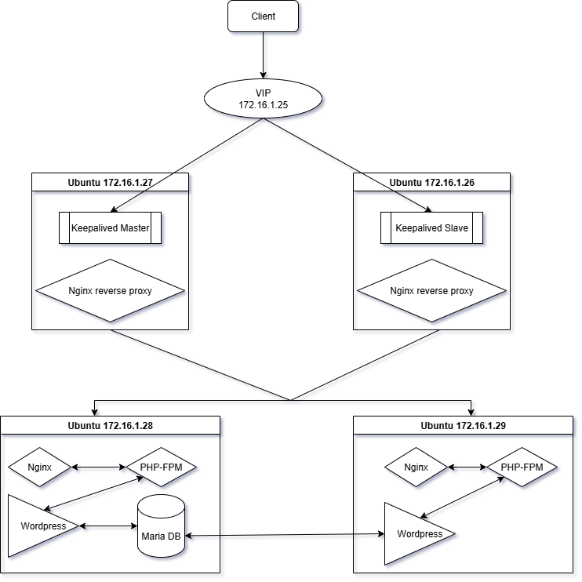

# Cài đặt và cấu hình Keepalive với nginx reverse proxy

## Tổng quan về Keepalive
- Keepalive là một phần mềm mã nguồn mở trên Linux dùng để:
    - Đảm bảo tính sẵn sàng cao (High Availability) cho dịch vụ
    - Tự động phát hiện lỗi và chuyển đổi (failover) giữa các server
    - Thường kết hợp với VRRP để chia sẻ địa chỉ IP ảo (Virtual IP – VIP)

### VRRP là gì?
- VRRP (Virtual Router Redundancy Protocol) là một giao thức giúp nhiều router hoặc server chia sẻ cùng một IP ảo.
- Giao thức VRRP là một giao thức cấp cao chạy trong hệ điều hành, không nằm trong hypervisor hay card mạng. Và chỉ xuất hiện khi cài keepalived và cấu hình VRRP
- Mục tiêu: Khi một router hay (server) chính bị lỗi, router khác sẽ tự động nhận IP ảo và tiếp tục cung cấp dịch vụ cho người dùng mà không bị gián đoạn.
- Giao thức IP tầng 3 (Layer 3), sử dụng multicast 224.0.0.18, protocol number 112 (đây là địa chỉ IP được gắn trong mạng nội bộ)

### Thành phần chính
- Keepalived bao gồm 3 thành phần chính:
    - VRRP (Virtual Router Redundancy Protocol): Quản lý IP ảo (Virtual IP - VIP) giữa các máy chủ để thực hiện failover
    - Health Checkers: Kiểm tra tình trạng của các dịch vụ backend
    - Configuration Scripts: Được sử dụng để thực thi các hành động tùy chỉnh dựa trên trạng thái hệ thống

### Cách hoạt động của Keepalived + VRRP
- Các thành phần chính trong VRRP:
    - Virtual Router (Router ảo): Đây là router đại diện cho một địa chỉ IP ảo (VIP). Các máy chủ trong mạng sẽ sử dụng IP ảo này làm gateway. VRRP đảm bảo rằng IP ảo sẽ luôn có một router "chủ" hoặc "primary" để xử lý lưu lượng.
    - Master Router: Là router đảm nhận vai trò cổng mặc định (gateway) cho các máy chủ hoặc thiết bị trong mạng. Đây là router chính có IP ảo (VIP).
    - Backup Router: Là router phụ, luôn giám sát tình trạng của router chính. Khi router chính gặp sự cố, router phụ sẽ trở thành router chủ và tiếp quản IP ảo.
    - Virtual IP Address (VIP): Là địa chỉ IP ảo mà các thiết bị mạng sử dụng làm gateway. Địa chỉ này không gắn với bất kỳ một máy chủ hoặc router cụ thể nào mà được chia sẻ giữa các router trong nhóm VRRP.
    - Priority: Mỗi router trong nhóm VRRP có một mức độ ưu tiên. Router với mức độ ưu tiên cao hơn sẽ trở thành router chủ. Nếu hai router có cùng mức độ ưu tiên, một trong hai sẽ được chọn dựa vào địa chỉ MAC của nó.
- Cơ chế hoạt động:
    - MASTER gán IP ảo (VIP) lên interface và gửi gói VRRP advertisement định kỳ qua multicast 224.0.0.18 (protocol 112) -> Thông báo cho các BACKUP "mình vẫn đang active"
    - BACKUP lắng nghe gói đó: Nếu nhận đều đặn → nó giữ nguyên trạng thái BACKUP.
    - Nếu BACKUP không nhận được gói VRRP trong thời gian timeout:
        - BACKUP sẽ hiểu rằng Master đã chết.
        - BACKUP sẽ chuyển sang MASTER, gán VIP lên interface, và gửi Gratuitous ARP để cập nhật mạng LAN.
    - Khi MASTER cũ hoạt động trở lại:
        - Nếu có priority cao hơn, nó giành lại VIP (preempt).
        - Nếu không, nó ở lại trạng thái BACKUP.

## Cài đặt và cấu hình Keepalived
- Yêu cầu: 2 server nginx proxy ( thông mạng ), đã cài đặt và cấu hình proxy load balancer
- Cài đặt Keepalived:
```sh
sudo apt update
sudo apt install keepalived -y
```
- Cấu hình Keepalived
- Trên server dùng làm Master
```sh
sudo nano /etc/keepalived/keepalived.conf
```
```conf
vrrp_instance VI_1 {
    state MASTER                # Router hiện tại là Master
    interface ens160            # Giao diện mạng sử dụng (eth0)
    virtual_router_id 09        # ID của nhóm VRRP, phải giống nhau giữa các router trong nhóm
    priority 101                # Mức độ ưu tiên của router này (giá trị càng cao thì càng ưu tiên làm Master)
    advert_int 1                # Thời gian giữa các lần quảng bá gói tin VRRP (tính bằng giây)
    authentication {
        auth_type PASS          # Loại xác thực (PASS là mật khẩu)
        auth_pass 1111          # Mật khẩu xác thực
    }
    virtual_ipaddress {
        172.16.1.25           # Địa chỉ IP ảo được chia sẻ giữa các router
    }
}
```
- Trên server dùng làm Backup
```sh
sudo nano /etc/keepalived/keepalived.conf
```
```conf
vrrp_instance VI_1 {
    state BACKUP                # Router hiện tại là Master
    interface ens160            # Giao diện mạng sử dụng (eth0)
    virtual_router_id 09        # ID của nhóm VRRP, phải giống nhau giữa các router trong nhóm
    priority 99                # Mức độ ưu tiên của router này (giá trị càng cao thì càng ưu tiên làm Master)
    advert_int 1                # Thời gian giữa các lần quảng bá gói tin VRRP (tính bằng giây)
    authentication {
        auth_type PASS          # Loại xác thực (PASS là mật khẩu)
        auth_pass 1111          # Mật khẩu xác thực
    }
    virtual_ipaddress {
        172.16.1.25           # Địa chỉ IP ảo được chia sẻ giữa các router
    }
}
```
- Giải thích cấu hình:
    - state MASTER: Thiết lập router này là router chủ (Master). Nếu router này bị ngừng hoạt động, một router khác có thể trở thành Master.
    - interface ens160: Chỉ định giao diện mạng mà VRRP sẽ chạy trên đó.
    - virtual_router_id 60: Xác định ID của nhóm VRRP. Các router trong cùng một nhóm phải có ID này giống nhau.
    - priority 101: Mức độ ưu tiên của router này. Router với mức độ ưu tiên cao sẽ trở thành Master.
    - advert_int 1: Thời gian giữa mỗi lần gửi gói tin quảng bá VRRP, tức là tần suất các router trong nhóm sẽ gửi gói tin VRRP để thông báo trạng thái của chúng.
    - authentication: Thiết lập phương thức xác thực. Trong trường hợp này, PASS được sử dụng và mật khẩu xác thực là 1111. Authentication trên Master với backup phải giống nhau
    - virtual_ipaddress: Địa chỉ IP ảo mà các máy chủ sẽ sử dụng làm gateway. IP này sẽ được chuyển giao giữa các router trong nhóm khi có sự cố.